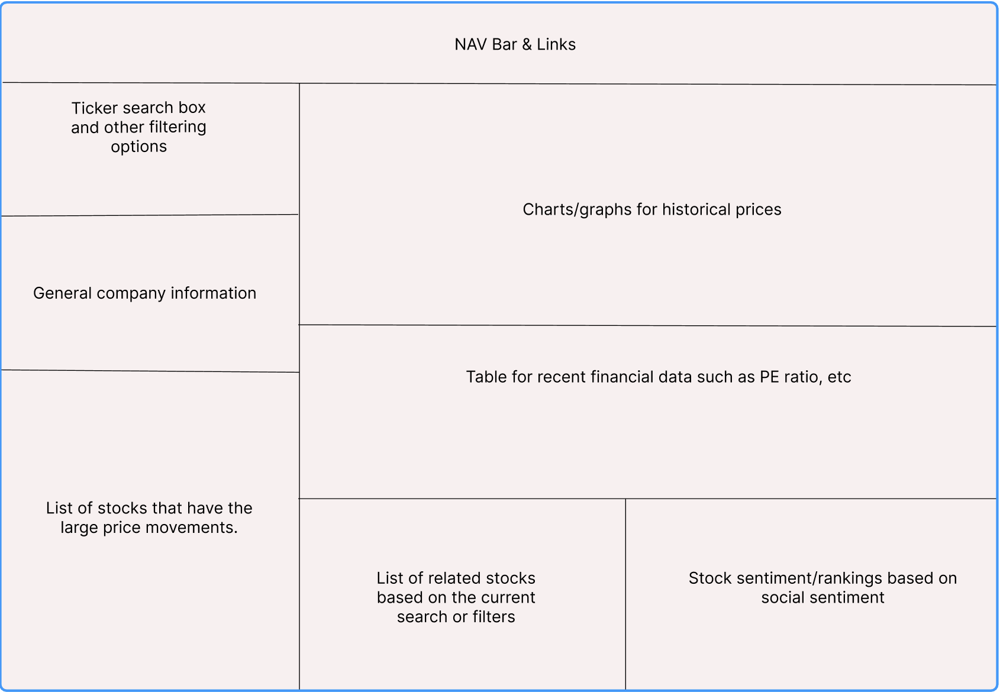

# StockWeiser

StockWeiser is a data visualization web app which allows the users to search and analyze stocks of their interests. We are at an era where too much information is available. Here we aim to provide the basic/core financial data for retail investors. 

Full disclaimer, this web page is not meant for any investment advice. This is solely a place for the user to obtain information about specific stocks. 

## Wireframe

## Functionality & MVPs
  - Input stock name or ticker in the search box, information will be fetched from the API and company context information will be printed. 
  - Charts about historical price movement about the stock will be rendered 
  - Lists of stocks with large movement in the day will show up on lower left of the page.
  - Social sentinent ranking about the stocks will be shown.
  - List of stocks in similar sector will be shown. 
### In addition, this project will include:
  - An instruction note section will be include to explain a few key terms about the data we show. Such as PE ratio (aka price to earning ratio). 
  - this README page. 

## Technologies, Libraries, APIs
  - Alpha Vantage API will be used for general stock information (prices, ratios, etc). https://www.alphavantage.co/ 
  - StockGeist API will be used to sotck sentiment/social sentiment feature. https://www.stockgeist.ai/ 
  - D3 or Chart.js will be used to render appropriate charts and graphs as needed. 
  - Webpack will be used to bundlce source files.

## Implementation Timeline
  - Friday Afternoon & Weekend: Finalize the APIs that I would need to use. Set up the project skeleton and read the API documents. 
  - Monday: Focus on making sure the APIs are working as expected, set up the logic that would allow me to pinpoint the data base on users inputs and selections. 
  - Tuesday: Focus on the UI interaction to make sure the web page respond appropriate to users actions. 
  - Wednesday: Heavy CSS day for styling and any final touch for the logic or UI.
  - Thursday Morning: Final testing and deploy.